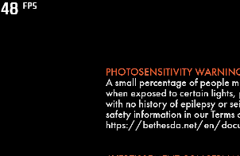
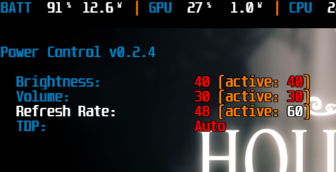
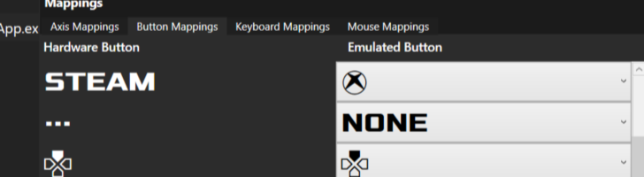

# Steam Deck Tools

This repository contains my own personal set of tools to help running Windows on Steam Deck.

## 1. Steam Deck Fan Control

This is a very early and highly experimental fan controller for Windows build based
on `linux/jupiter-fan-control.py` available on SteamOS.

### 1.1. Usage

You can download latest precompiled build from Releases tab. Currently the application requires
administrative privileges in order to read various temperature sensors.

It provides 3 modes of operation:

1. **Default** - use EC to control fan (as done today)
1. **SteamOS** - use reimplemented `jupiter-fan-control.py` (as in SteamOS when Fan Control is enabled)
1. **Max** - blow at full speed.

### 1.2. How it works?

This uses highly unstable (and firmware specific) direct manipulation of kernel memory
to control usage of EC (Embedded Controller) and setting desired fan RPM via VLV0100.

It was build based on knowledge gained in Steam Deck kernel patch and DSDT presented by bios.
The memory addresses used are hardcoded and can be changed any moment by the Bios update.

### 1.3. Limitations

As of Today (Nov, 2022) the GPU temperature is missing on Windows. Which makes it a little incomplete.
However, it should be expected that GPU temperature is "kind of similar" to CPU due to GPU being in the same
silicon. But! The device might overheat and break due to this missing temperature. **So, use at your own risk.**

### 1.4. Supported devices

The application tries it best to not harm device (just in case). So, it validates bios version.
Those are currently supported:

- F7A0107 (PD ver: 0xB030)
- F7A0110 (PD ver: 0xB030)

## 2. Performance Overlay

This is a very simple application that requires [Rivatuner Statistics Server Download](https://www.rivatuner.org/)
and provides asthetics of SteamOS Performance Overlay.

Uninstall MSI Afterburner and any other OSD software.

It currently registers two global hotkeys:

- **F11** - enable performance overlay
- **Shift+F11** - cycle to next performance overlay (and enable it)

There are 5 modes of presentation:

### 2.1. FPS

### 2.2. FPS with Battery

### 2.3. Minimal

### 2.4. Detail

### 2.5. Full

## 3. Power Control

This is a very simple application that requires [Rivatuner Statistics Server Download](https://www.rivatuner.org/)
and provides an easily accessible controls.

Uninstall MSI Afterburner and any other OSD software.

There are currently 4 configurable settings:

- Volume
- Brightness
- Refresh Rate
- FPS Limit (requires: RTSS > Setup > Enable Framelimit)
- TDP
- OSD / OSDMode (requires PerformanceOverlay running)
- Fan (requires FanControl running)

### 3.1. Use it

It will only work in OSD mode when rendering graphics.
The notification setting is always available.

- SteamDeck Controller: press and hold Quick Access (3 dots), and then DPad Left, Rigth, Up, Down.
- Keyboard: `Ctrl+Win+Numpad2` (Down), `Ctrl+Win+Numpad4` (Left), `Ctrl+Win+Numpad6` (Right), `Ctrl+Win+Numpad8` (Up)

Additional shortcuts:

- Control Volume: use Volume Up and Down
- Control Brightness: press and hold Quick Access (3 dots), and then Volume Up and Down
- Press `3 dots + L4 + R4 + L5 + R5` to reset (TDP, Refresh Rate, FPS limit) to default

### 3.2. SWICD configuration

Since the SWICD will mess-up with double inputs you need to configure the following

- Set 3 dots to **NONE** in button mapping

    

- Add **Button Actions** for all 4 controls: 3 dots + DPad Left/Right/Up/Down, **CLEAR** Keyboard Shortcut

    

    

## Author

Kamil Trzciński, 2022, License GPLv3
