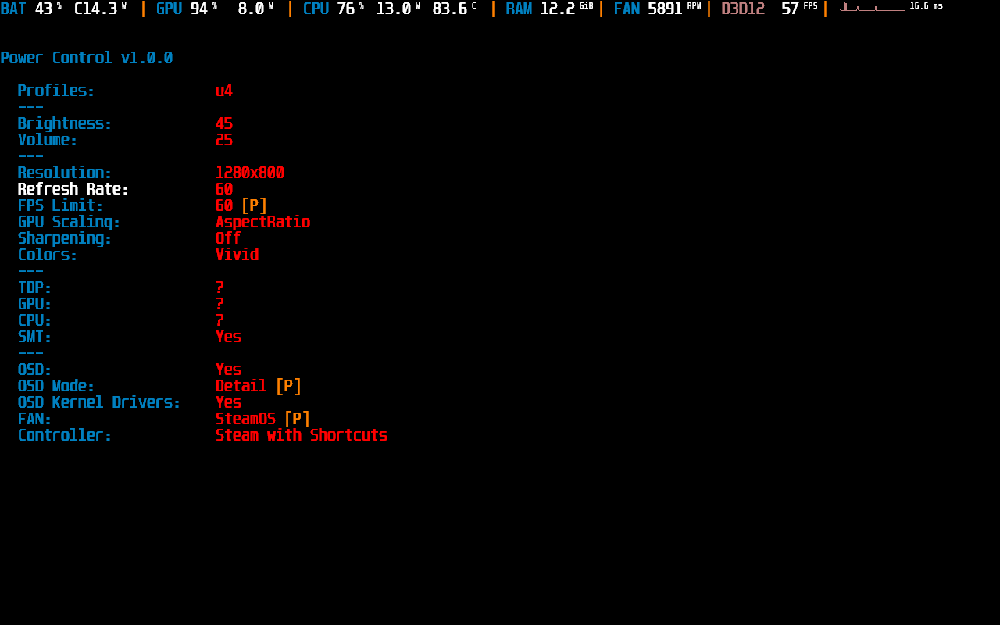
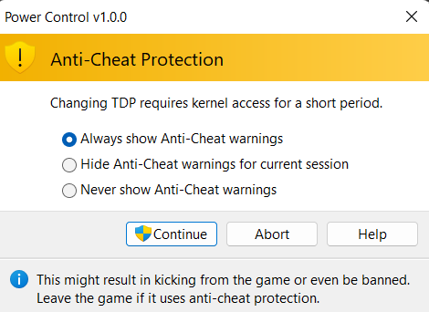

# README

**This software is provided on best-effort basis and can break your SteamDeck.**

## Help this project

**This project is provided free of charge, but development of it is not free - it takes a lot of effort**:

- Consider donating to keep this project alive.
- Donating also helps to fund new features.

 

## Applications

This project provides the following applications:

- [Fan Control](fan-control.md) - control Fan on Windows
- [Performance Overlay](performance-overlay.md) - see FPS and other stats
- [Power Control](power-control.md) - change TDP or refresh rate
- [Steam Controller](steam-controller.md) - use Steam Deck with Game Pass

## Install

Download and install latest `SteamDeckTools-<version>-setup.exe` from [Latest GitHub Releases](https://github.com/ayufan/steam-deck-tools/releases/latest).

This project requires those dependencies to be installed in order to function properly. Those dependencies needs to be manually installed if portable archive is to be used:

- [Microsoft Visual C++ Redistributable](https://aka.ms/vs/17/release/vc_redist.x64.exe)
- [Rivatuner Statistics Server](https://www.guru3d.com/files-details/rtss-rivatuner-statistics-server-download.html)
- [ViGEmBus](https://github.com/ViGEm/ViGEmBus/releases)

It is strongly advised that following software is uninstalled or disabled:

- [SWICD](https://github.com/mKenfenheuer/steam-deck-windows-usermode-driver)
- [GlosSI](https://github.com/Alia5/GlosSI)
- [HidHide](https://github.com/ViGEm/HidHide)

## Additional informations

- [Controller Shortcuts](shortcuts.md) - default shortcuts when using [Steam Controller](steam-controller.md).
- [Development](development.md) - how to compile this project.
- [Risks](risks.md) - this project uses kernel manipulation and might result in unstable system.
- [Privacy](privacy.md) - this project can connect to remote server to check for auto-updates or track errors
- [Troubleshooting](troubleshooting.md) - if you encounter any problems.
- The latest beta version can be found in [GitHub Releases](https://github.com/ayufan/steam-deck-tools/releases).

## Join Us

Join Us for help or chat. We are at [#windows of Steam Deck Discord](https://discord.gg/steamdeck).

## Anti-Cheat and Antivirus software

Since this project uses direct manipulation of kernel memory via `inpoutx64.dll`
it might trigger Antivirus and Anti-Cheat software.

**READ IF PLAYING ONLINE GAMES AND/OR GAMES THAT HAVE ANTI-CHEAT ENABLED**

Since this project uses direct manipulation of kernel memory via `inpoutx64.dll`
it might trigger Antivirus and Anti-Cheat software. This could result in interference
or issues in games that use anti-cheat technology (including the possibility of a suspension or ban).

Application by default does not use any kernel-level features. If you request a change
that might trigger anti-cheat detection application does require to acknowledge this.

### Safe settings

If you play online games application needs to disable kernel-features.
**Those settings should be considered safe**:

- **Fan Control**: Use **Default** FAN
- **Performance Overlay**: OSD Kernel Drivers are **DISABLED**

### Features missing without Kernel Drivers

By disabling usage of Kernel Drivers you are loosing the:

- **Fan Control**: Optimised `SteamOS` FAN curve
- **Performance Overlay**: See CPU % and MHz, GPU MHz, APU W usage
- **Power Control**: Ability to change TDP, CPU and GPU frequency - you can change this safely before you start the game
- **Steam Controller**: There's no impact

## Supported devices

The application tries it best to not harm device (just in case).
So, it validates bios version. Those are currently supported:

- F7A0107 (PD ver: 0xB030)
- F7A0110 (PD ver: 0xB030)
- F7A0113 (PD ver: 0xB030)
- F7A0115 (PD ver: 0xB030)

## Author

Kamil Trzciński, 2022-2023

Steam Deck Tools is not affiliated with Valve, Steam, or any of their partners.

## License

[Creative Commons Attribution-NonCommercial-ShareAlike (CC-BY-NC-SA)](http://creativecommons.org/licenses/by-nc-sa/4.0/).

Free for personal use. Contact me in other cases (`ayufan@ayufan.eu`).
