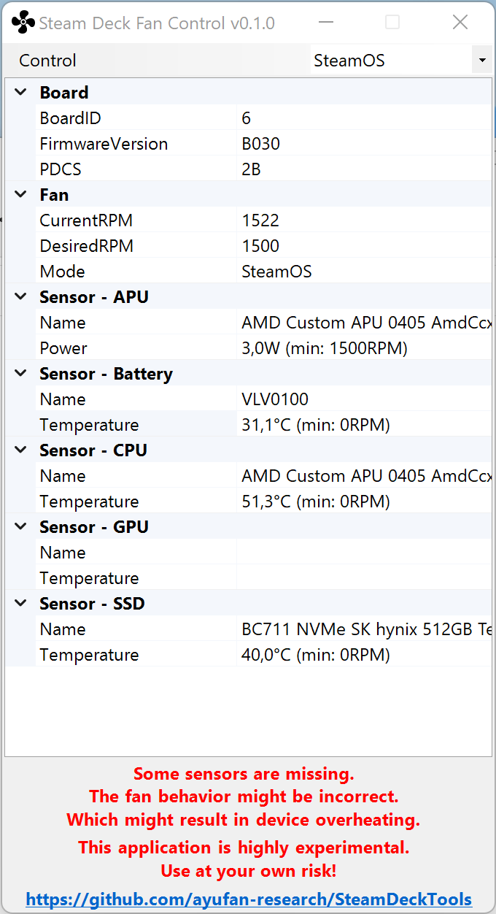

# Fan Control

This is a very early and highly experimental fan controller for Windows build based
on `linux/jupiter-fan-control.py` available on SteamOS.

## 1. Usage

You can download latest precompiled build from Releases tab. Currently the application requires
administrative privileges in order to read various temperature sensors.

It provides 3 modes of operation:

1. **Default** - use EC to control fan (as done today)
1. **SteamOS** - use reimplemented `jupiter-fan-control.py` (as in SteamOS when Fan Control is enabled)
1. **Max** - blow at full speed.

## 2. How it works?

See [Risks](#4-risks).

## 3. Limitations

As of Today (Nov, 2022) the GPU temperature is missing on Windows. Which makes it a little incomplete.
However, it should be expected that GPU temperature is "kind of similar" to CPU due to GPU being in the same
silicon. But! The device might overheat and break due to this missing temperature. **So, use at your own risk.**
