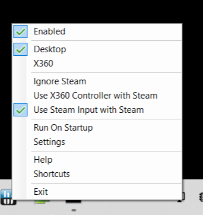
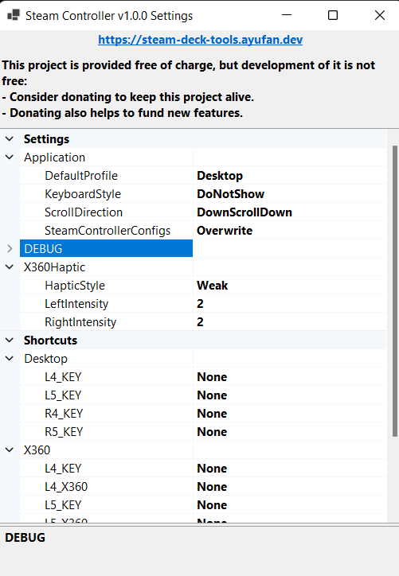

# Steam Controller

This is highly experimental "opinionated" implementation of Steam Controller that is meant
to replace [SWICD](https://github.com/mKenfenheuer/steam-deck-windows-usermode-driver/)
and [Glossi](https://github.com/Alia5/GlosSI). This is hard piece and it is rather
unsupported (by me), so if it works it works.

 

## 1. Modes

It offers 3 main modes of operation:

- **Desktop**
- **X360 emulation** (with Haptics) - activated automatically when entering Playnite Fullscreen
- **Steam** - active automatically when running Steam Gamepad UI, Steam Big Screen UI or running Steam Game

**You need to select profile after running application**. Choose one of:

- `Use X360 Controller with Steam` (most compatible)
- `Use Steam Input with Steam` (works, but might be quirky)

You can easily switch between Desktop and X360 by holding Options button (3 horizontal lines,
on top of the right joystick). When profile is switched you will hear a beep.

## 2. Requirements

It is strongly advised that you uninstall (unless you know what are you doing):

1. [SWICD](https://github.com/mKenfenheuer/steam-deck-windows-usermode-driver)
1. [GlosSI](https://github.com/Alia5/GlosSI)
1. [HidHide](https://github.com/ViGEm/HidHide)

Requirements:

1. Ensure that you have SWICD, Glossi and HidHide disabled, stopped or uninstalled!
1. Ensure that HidHide is disabled, or ensure that `Steam Controller.exe` can see `Neptune Valve Controller`.
1. Install latest version of [https://github.com/ViGEm/ViGEmBus/releases](https://github.com/ViGEm/ViGEmBus/releases).

## 3. Possible setups

The are various ways how `Steam Controller` can work with Steam.
If you do not use Steam this is simple, just run it and enjoy.
Since when there's no Steam, there's no problem at all.

### 3.1. Most compatible - Use X360 Controller with Steam

**You enable it by selecting `Use X360 Controller with Steam`.**

This pretty much work always. It hides the `Valve Software Steam Controller` from Steam.

It is out of box experience. In this mode you would use either Desktop or X360 controls,
and all Steam games would use X360.

The Back Panel buttons can be assigned to some user-defined keys.

### 3.2. Works, but sometimes finicky - Use Steam Input with Steam

**You enable it by selecting `Use Steam Input with Steam`.**

It is **required** to configure Steam as described in [Configure Steam](#5-configure-steam).

This is setup that allows you to enable `Steam Input` and use community provided profiles
on Steam. However, this requires special configuration and in some cases is finicky.

The `SteamController.exe` automatically detects Steam running game and disable itself
for the duration of game play switch to specially currated `Steam profile` (non selectable, and hidden).

The are two primary ways how to use it. The best experience is achieved when
**STEAM IS NOT RUNNING IN BACKGROUND**. Use Playnite Fullscreen to start game on the Steam
and close it after session (there's an option in Playnite settings). Keep Steam closed
otherwise at all times.

Alternative if Steam is running in background it should be pretty stable when
[configured desktop mode buttons](#5-configure-steam). There will be sometimes finicky behavior
when using STEAM button shortcuts. However, this is mostly stable otherwise.

> Getting controllers support is hard especially with Steam not making it easy to disable it.
> I'm doing this to solve my usage pattern. So, I might have limited will to fix all quirks
> of handling Steam running in background alongside `Steam Controller`. This will never
> be supported mode of operation.

### 3.3. If you know what you do - Ignore Steam

This makes `Steam Controller` to disable Steam detection. Now, you would have to do everything
you were doing before: like HidHide, additional controllers, etc.

It is **not needed** to configure Steam as described in [Configure Steam](#3-configure-steam).

In this mode you would use either Desktop or X360 controls, and all Steam games would use X360.
When running in this mode you would have to switch between Desktop and X360 mode with `Options` button
or with `PowerControl`.

Of course you will have access to all described shortcuts.

## 4. Shortcuts

[See it here](shortcuts.md)

## 5. Configure Steam

**Steam Controller** does overwrite default Steam configuration, but if you made changes to some
of the controller profiles those overwrites will not be applied. You need to set them yourself.

This is required since if Steam is running in background it is essential to ensure that
Desktop mode configuration is empty, otherwise there might be double inputs in non-Steam games.

### 5.1. Disable Desktop mode in Steam Gamepad UI (preferred)

1. Run `steam.exe` with `-gamepadui`.
1. Click `Steam` button, go to `Settings` > `Controller`.
1. If you see the [`Official Layout for - SteamController provided empty configuration`](images/steam_controller_gamepadui_configuration.png) you are done.
1. Otherwise, select new layout, and go to `RECOMMENDED`.
1. In `RECOMMENDED` there will be [`SteamController provided empty configuration`](images/steam_controller_gamepadui_templates.png).
1. Select it. And you are done.

### 5.2. Disable Desktop mode in Steam Desktop (ok, but change scale to 100%)

**This requires that your Desktop scale is set to 100%.**
It is buggy on `125%`. You will not be able to click `Browse Configs`.

1. Run Steam.
1. Go to `Steam` > `Settings` > `Controller` > `Desktop Configuration`.
1. If you see the [`SteamController provided empty configuration`](images/steam_controller_desktop_configuration.png) you are done.
1. Otherwise, click `BROWSE CONFIGS`.
1. In `RECOMMENDED` there will be `SteamController provided empty configuration` ([take a look](images/steam_controller_desktop_templates.png)).
1. Select it, and `APPLY CONFIGURATION`.
1. Now, click `DONE`.

## 6. Fullscreen Scaling Hotkey (Steam + Up Pad Press)

Many games in Windows will crash when attempting to start in fullscreen.  To have a fullscreen experience on the Steam Deck, you can use this keybind in any fullscreen scaling application to provide a shortcut capable of toggling the scaling.

Example of Scaling software: https://store.steampowered.com/app/993090/Lossless_Scaling/

To configure the hotkey in Lossless Scaling:

1. Launch Lossless Scaling
1. Open "Settings"
1. Select the "Scale hotkey"
1. Press "STEAM + DPad Up"
1. Verify that the hotkey was set to "CTRL + ALT + U"
1. Close the settings dialog

## 7. Uninstall

Since `Steam Controller` changes Steam you need to follow those steps to properly uninstall the app:

1. Run `Steam Controller`
2. **Select `Use X360 Controller with Steam` or `Use Steam Input with Steam` IF IT IS NOT SELECTED**
3. Now, select `Ignore Steam` to remove `Steam Controller` from Steam
4. Next go to `Steam > Settings > Controller` and revert all changes made to `Desktop configuration`

## 8. Managed configs

The `Steam Controller` will manage default steam controller configs
and install controller templates to ease controller management.
It does modify:

- `C:\Program Files (x86)\Steam\controller_base\chord_neptune.vdf`
- `C:\Program Files (x86)\Steam\controller_base\desktop_neptune.vdf`
- `C:\Program Files (x86)\Steam\controller_base\templates\controller_neptune_steamcontroller.vdf`
