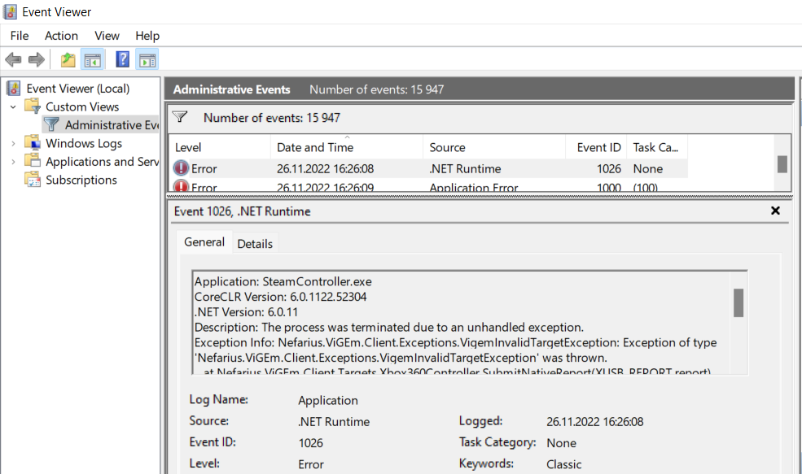

# Troubleshooting

Any of the applications might crash. Those are following things that might help
find the problem:

1. Ensure that [project dependencies](README.md#install) are installed.
2. Find error in [Event Viewer](#event-viewer).

## Event Viewer

1. Open `Event Viewer` in Windows.
1. Under `Custom Events > Administrative Events` find recent `.NET Runtime`.
1. Errors registered for Steam Deck Tools will have **Application:** to be one of:
    - `FanControl.exe`
    - `PerformanceOverlay.exe`
    - `PowerControl.exe`
    - `SteamController.exe`
1. Open issue in [GitHub](https://github.com/ayufan-research/steam-deck-tools/)
  with details what happened, when and included `exception`.
    
